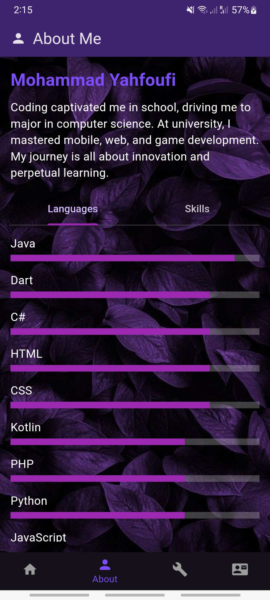
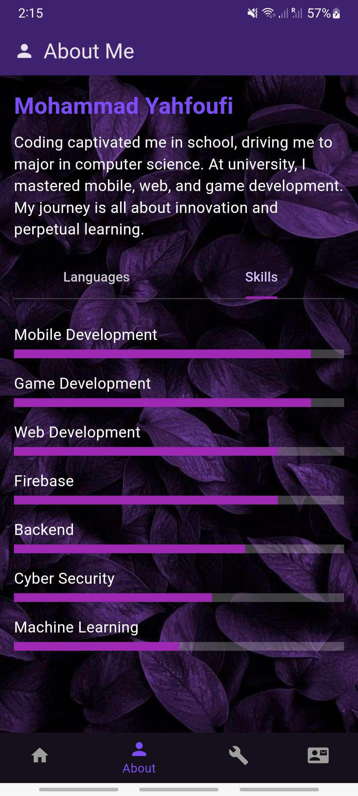
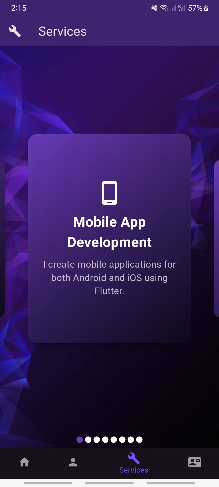
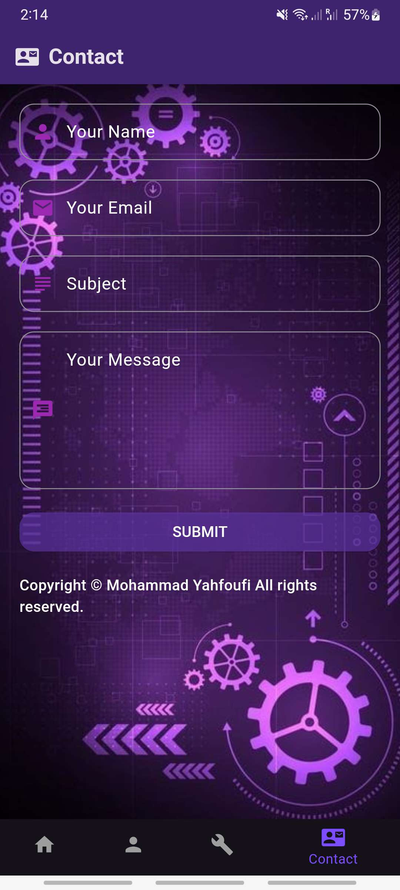

# 💼 Flutter Portfolio

A showcase of my work and skills in Flutter development. This repository demonstrates the mobile and web applications I've created using Flutter and various related technologies.

---

## 🚀 Demo Video

Watch the video below to see a demo of my Flutter portfolio in action, showcasing different pages and animations:

[Portfolio Demo](https://youtube.com/shorts/eUSn0WTTZnQ?feature=share)

---

## 📸 Screenshots

Here are some screenshots of the app showcasing different sections:

| Home Screen | About Languages | About Skills |
|-------------|-----------------|--------------|
|  |  |  |

| Services | Contact |
|----------|---------|
|  |  |

---

## ✨ Features

- **Interactive UI** with custom animations
- **Dynamic service carousel** showcasing various skills and services
- **Contact form** that allows users to send messages directly
- **Responsive design** that works well on mobile and web platforms
- **Video showcase** demonstrating the app’s functionality

---

## 📦 Built With

- **Flutter** – Framework for building natively compiled applications for mobile, web, and desktop from a single codebase.
- **Dart** – Programming language used for building the Flutter app.
- **Firebase** – Backend services (optional for some features).
- **YouTube API** – For displaying videos on the app.

---
